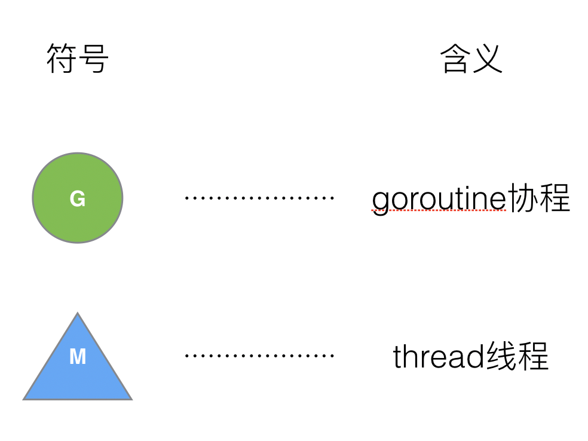
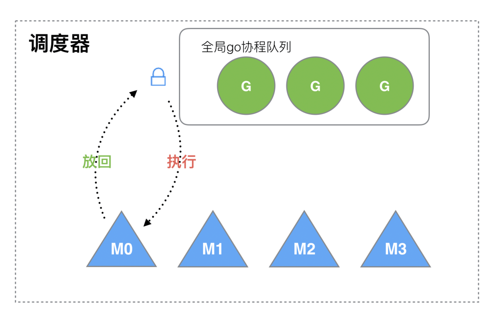
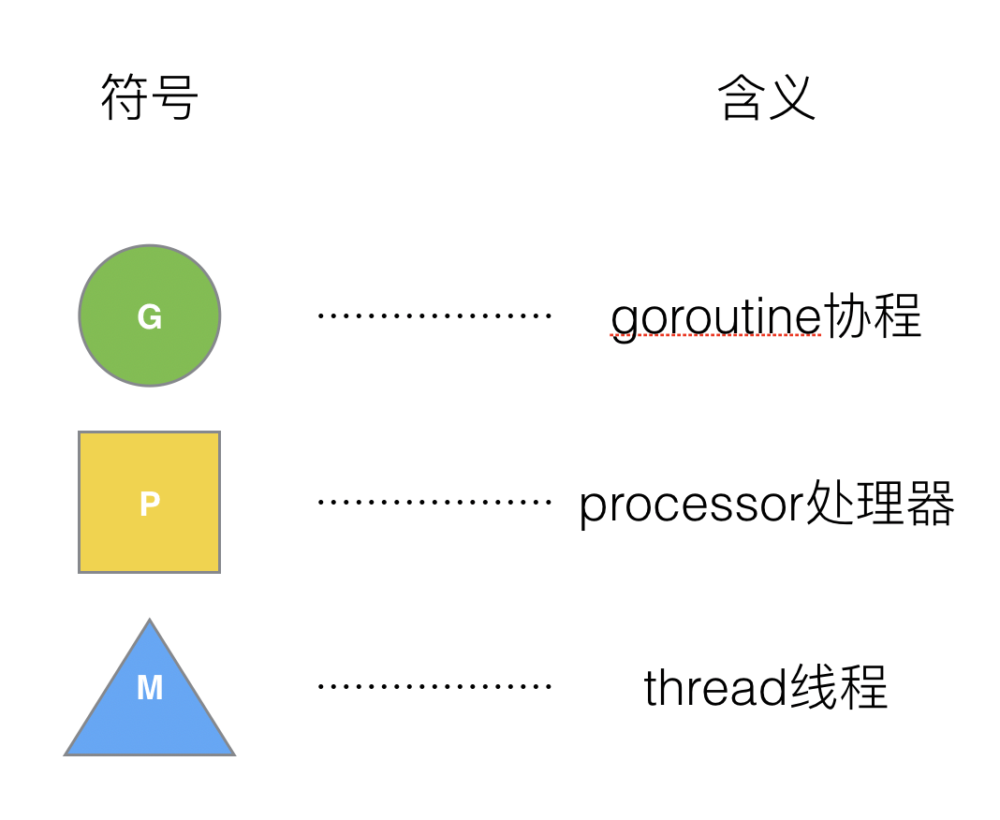

# Golang GMP调度器

### 一、进程与线程

1.**进程**是操作系统进行资源分配和调度的一个独立单位，不同的进程通过进程间通信来通信。**由于进程比较重量，占据独立的内存，所以上下文进程间的切换开销（栈、寄存器、虚拟内存、文件句柄等）比较大**，但相对比较稳定安全。

2.**线程**是进程的一个实体,是CPU调度和分派的基本单位,它是比进程更小的能独立运行的基本单位.线程自己基本上不拥有系统资源,只拥有一点在运行中必不可少的资源(如程序计数器,一组寄存器和栈),但是它可与同属一个进程的其他的线程共享进程所拥有的全部资源。线程间通信主要通过共享内存，**上下文切换很快，资源开销较少，但相比进程不够稳定容易丢失数据**。

虽然线程比较轻量，但是在调度时也有比较大的额外开销。每个线程会都占用 1 兆以上的内存空间，在对线程进行切换时不止会消耗较多的内存，恢复寄存器中的内容还需要向操作系统申请或者销毁对应的资源，每一次线程上下文的切换都需要消耗 ~1us 左右的时间[1](https://draveness.me/golang/docs/part3-runtime/ch06-concurrency/golang-goroutine/#fn:1)，但是 Go 调度器对 Goroutine 的上下文切换约为 ~0.2us，减少了 80% 的额外开销[2](https://draveness.me/golang/docs/part3-runtime/ch06-concurrency/golang-goroutine/#fn:2)。

##### **Go 语言的调度器通过使用与 CPU 数量相等的线程减少线程频繁切换的内存开销，同时在每一个线程上执行额外开销更低的 Goroutine 来降低操作系统和硬件的负载。**

### 二、Golang调度器

#### 1.Go 语言的协程 goroutine

Go 为了提供更容易使用的并发方法，使用了 goroutine 和 channel。goroutine 来自协程的概念，让一组可复用的函数运行在一组线程之上，即使有协程阻塞，该线程的其他协程也可以被 runtime 调度，转移到其他可运行的线程上。最关键的是，程序员看不到这些底层的细节，这就降低了编程的难度，提供了更容易的并发。

Go 中，协程被称为 goroutine，它非常轻量，一个 goroutine 只占几 KB，并且这几 KB 就足够 goroutine 运行完，这就能在有限的内存空间内支持大量 goroutine，支持了更多的并发。虽然一个 goroutine 的栈只占几 KB，但实际是可伸缩的，如果需要更多内容，runtime 会自动为 goroutine 分配。

Goroutine 特点：

占用内存更小（几 kb）
调度更灵活 (runtime 调度)

#### 2.调度器历史

今天的 Go 语言调度器有着优异的性能，但是如果我们回头看 Go 语言的 0.x 版本的调度器就会发现最初的调度器不仅实现非常简陋，也无法支撑高并发的服务。调度器经过几个大版本的迭代才有今天的优异性能，几个不同版本的调度器引入了不同的改进，也存在不同的缺陷:

- [单线程调度器](#单线程调度器) ·0.x
  - 只包含 40 多行代码；
  - 程序中只能存在一个活跃线程，由 G-M 模型组成；
- [多线程调度器](#多线程调度器) ·1.0
  - 允许运行多线程的程序；
  - 全局锁导致竞争严重；
- 任务窃取调度器 ·1.1
  - 引入了处理器 P，构成了目前的 **G-M-P** 模型；
  - 在处理器 P 的基础上实现了基于**工作窃取**的调度器；
  - 在某些情况下，Goroutine 不会让出线程，进而造成饥饿问题；
  - 时间过长的垃圾回收（Stop-the-world，STW）会导致程序长时间无法工作；
- 抢占式调度器 ·1.2~ 至今
  - 基于协作的抢占式调度器 - 1.2 ~ 1.13
    - 通过编译器在函数调用时插入**抢占检查**指令，在函数调用时检查当前 Goroutine 是否发起了抢占请求，实现基于协作的抢占式调度；
    - Goroutine 可能会因为垃圾回收和循环长时间占用资源导致程序暂停；
  - 基于信号的抢占式调度器 - 1.14 ~ 至今
    - 实现**基于信号的真抢占式调度**；
    - 垃圾回收在扫描栈时会触发抢占调度；
    - 抢占的时间点不够多，还不能覆盖全部的边缘情况；


其中1.1版本之前的调度器未使用GMP模型，2012年之后golang开始引入GMP模型并实现了几个版本的调度器

先来分析被废弃的老版本调度器的设计原理与实现：

老版本的调度器只存在两个角色，即G&M



老版本的调度器包括0.x的单线程调度器（几乎不可用）和1.0的多线程调度器，总体的实现思路如下（0.x版本只有M0）



##### 单线程调度器

0.x 版本调度器只包含表示 Goroutine 的 G 和表示线程的 M 两种结构，全局也只有一个线程。我们可以在 [clean up scheduler](https://github.com/golang/go/commit/96824000ed89d13665f6f24ddc10b3bf812e7f47) 提交中找到单线程调度器的源代码，在这时 Go 语言的[调度器](https://github.com/golang/go/blob/96824000ed89d13665f6f24ddc10b3bf812e7f47/src/runtime/proc.c)还是由 C 语言实现的，调度函数 [`runtime.schedule`](https://github.com/golang/go/blob/96824000ed89d13665f6f24ddc10b3bf812e7f47/src/runtime/proc.c#L340) 也只包含 40 多行代码 ：

```c
static void scheduler(void) {
	G* gp;
	//获取调度器的全局锁；
	lock(&sched);
	//调用 runtime.gosave 保存栈寄存器和程序计数器；
	if(gosave(&m->sched)){
		lock(&sched);
		gp = m->curg;
		switch(gp->status){
		case Grunnable:
		case Grunning:
			gp->status = Grunnable;
			gput(gp);
			break;
		...
		}
		notewakeup(&gp->stopped);
	}
	//调用 runtime.nextgandunlock 获取下一个需要运行的 Goroutine 并解锁调度器；
	gp = nextgandunlock();
	noteclear(&gp->stopped);
	gp->status = Grunning;
	//修改全局线程 m 上要执行的 Goroutine；
	m->curg = gp;
	g = gp;
	//调用 runtime.gogo 函数运行最新的 Goroutine；
	gogo(&gp->sched);
}
```

##### 多线程调度器

Go 语言在 1.0 版本正式发布时就支持了多线程的调度器，与上一个版本几乎不可用的调度器相比，Go 语言团队在这一阶段实现了从不可用到可用的跨越。我们可以在 [`pkg/runtime/proc.c`](https://github.com/golang/go/blob/go1.0.1/src/pkg/runtime/proc.c) 文件中找到 1.0.1 版本的调度器，多线程版本的调度函数 [`runtime.schedule`](https://github.com/golang/go/blob/go1.0.1/src/pkg/runtime/proc.c#L838) 包含 70 多行代码，我们在这里保留了该函数的核心逻辑：

```c
static void schedule(G *gp) {
	schedlock();
	if(gp != nil) {
		gp->m = nil;
		uint32 v = runtime·xadd(&runtime·sched.atomic, -1<<mcpuShift);
		if(atomic_mcpu(v) > maxgomaxprocs)
			runtime·throw("negative mcpu in scheduler");

		switch(gp->status){
		case Grunning:
			gp->status = Grunnable;
			gput(gp);
			break;
		case ...:
		}
	} else {
		...
	}
	gp = nextgandunlock();
	gp->status = Grunning;
	m->curg = gp;
	gp->m = m;
	runtime·gogo(&gp->sched, 0);
}
```

整体的逻辑与单线程调度器没有太多区别，因为我们的程序中可能同时存在多个活跃线程，所以多线程调度器引入了 `GOMAXPROCS` 变量帮助我们灵活控制程序中的最大处理器数，即活跃线程数。

M 想要执行、放回 G 都必须访问全局 G 队列，并且 M 有多个，即多线程**访问同一资源需要加锁进行保证互斥 / 同步**，所以全局 G 队列是有互斥锁进行保护的。

老调度器有几个缺点：

1.创建、销毁、调度 G 都需要每个 M 获取锁，这就形成了激烈的锁竞争。
2.M 转移 G 会造成延迟和额外的系统负载。比如当 G 中包含创建新协程的时候，M 创建了 G’，为了继续执行 G，需要把 G’交给 M’执行，也造成了很差的局部性，因为 G’和 G 是相关的，最好放在 M 上执行，而不是其他 M’。
3.系统调用 (CPU 在 M 之间的切换) 导致频繁的线程阻塞和取消阻塞操作增加了系统开销。

基于以上问题，2012年Google 的工程师 Dmitry Vyukov 在G-M模型的基础上提出了G-M-P模型

#### 3.基于G-M-P模型的调度器

在新调度器中，出列 M (thread) 和 G (goroutine)，又引进了 P (Processor)。



#####  GMP 模型

在 Go 中，**线程是运行 goroutine 的实体，调度器的功能是把可运行的 goroutine 分配到工作线程上**。


全局队列（Global Queue）：存放等待运行的 G。
P 的本地队列：同全局队列类似，存放的也是等待运行的 G，存的数量有限，不超过 256 个。新建 G’时，G’优先加入到 P 的本地队列，如果队列满了，则会把本地队列中一半的 G 移动到全局队列。
P 列表：所有的 P 都在程序启动时创建，并保存在数组中，最多有 GOMAXPROCS(可配置) 个。
M：线程想运行任务就得获取 P，从 P 的本地队列获取 G，P 队列为空时，M 也会尝试从全局队列拿一批 G 放到 P 的本地队列，或从其他 P 的本地队列偷一半放到自己 P 的本地队列。M 运行 G，G 执行之后，M 会从 P 获取下一个 G，不断重复下去。
Goroutine 调度器和 OS 调度器是通过 M 结合起来的，每个 M 都代表了 1 个内核线程，OS 调度器负责把内核线程分配到 CPU 的核上执行。

**运行时 G-M-P 模型中引入的处理器 P 是线程和 Goroutine 的中间层，我们从它的结构体中就能看到处理器与 M 和 G 的关系**：

```c
struct P {
	Lock;

	uint32	status;
	P*	link;
	uint32	tick;
	M*	m;
	MCache*	mcache;

	G**	runq;
	int32	runqhead;
	int32	runqtail;
	int32	runqsize;

	G*	gfree;
	int32	gfreecnt;
};

```

处理器持有一个由可运行的 Goroutine 组成的环形的运行队列 `runq`（本地队列），还反向持有一个线程。调度器在调度时会从处理器的队列中选择队列头的 Goroutine 放到线程 M 上执行

第一版实现GMP模型的是Golang1.1的任务窃取调度器

##### 任务窃取调度器

```c
static void schedule(void) {
    G *gp;
 top:
 		//如果当前运行时在等待垃圾回收，调用 runtime.gcstopm 函数；
    if(runtime·gcwaiting) {
        gcstopm();
        goto top;
    }
		//调用 runtime.runqget 和 runtime.findrunnable 从本地或者全局的运行队列中获取待执行的 Goroutine；
    gp = runqget(m->p);
    if(gp == nil)
        gp = findrunnable();

    ...
		//调用 runtime.execute 函数在当前线程 M 上运行 Goroutine；
    execute(gp);
}
```


##### 有关 P 和 M 的个数问题

1、P 的数量：

由启动时环境变量 $GOMAXPROCS 或者是由 runtime 的方法 GOMAXPROCS() 决定。这意味着在程序执行的任意时刻都只有 $GOMAXPROCS 个 goroutine 在同时运行。
2、M 的数量:

go 语言本身的限制：go 程序启动时，会设置 M 的最大数量，默认 10000. 但是内核很难支持这么多的线程数，所以这个限制可以忽略。
runtime/debug 中的 SetMaxThreads 函数，设置 M 的最大数量
一个 M 阻塞了，会创建新的 M。
M 与 P 的数量没有绝对关系，一个 M 阻塞，P 就会去创建或者切换另一个 M，所以，即使 P 的默认数量是 1，也有可能会创建很多个 M 出来。

##### P 和 M 何时会被创建

1、P 何时创建：在确定了 P 的最大数量 n 后，运行时系统会根据这个数量创建 n 个 P。

2、M 何时创建：没有足够的 M 来关联 P 并运行其中的可运行的 G。比如所有的 M 此时都阻塞住了，而 P 中还有很多就绪任务，就会去寻找空闲的 M，而没有空闲的，就会去创建新的 M。