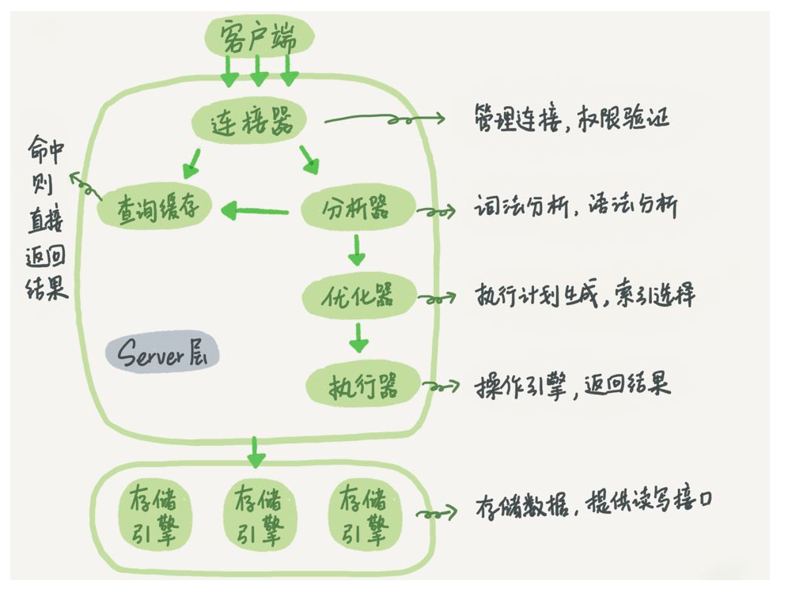

# Mysql

## 01-基础架构：一条sql语句的执行流程

以下是MySQL基本架构示意图



### 分析一条sql语句的执行过程

```mysql
select * from T where ID=10；
```

### MySQL可以分为Server层和存储引擎层

**Server层**又包括连接器，查询缓存，分析器，优化器和执行器等，涵盖MySQL的大多数核心服务功能，以及所有的内置函数（如日期、时间、数学和加密函数等），所有跨存储引擎的功能都在这一层实现，比如存储过程、触发器、视图等

**存储引擎层**负责数据的存储与提取，是插件式的，支持InnoDB、MyISAM、Memory等多个存储引擎（5.5.5版本之后默认的存储引擎是InnoDB）

#### Server层：

1.**连接器**

连接器负责跟客户端建立连接、获取权限、维持和管理连接。

连接命令一般是这么写的：

```shell
mysql -h$ip -P$port -u$user -p
```

以上命令中的mysql是客户端工具，用来跟服务端建立连接

客户端如果太长时间没动静，连接器就会自动将它断开。这个时间是由参数wait_timeout控制的，默认值是8小时。

2.**查询缓存**

连接建立完成，接下来执行select语句，执行逻辑来到第二步：查询缓存

MySql拿到一个查询请求之后，会先到查询缓存寻找之前是否执行过这条语句（若执行过，结果可能会被以key-value的形式直接缓存在内存中）如果有则直接返回给客户端，如果没有，则语句执行完成后执行结果会被存入查询缓存中

**查询缓存的弊端**：查询缓存的失效非常频繁，只要有对一个表的更新，这个表上所有的查询缓存都会被清空。因此很可能你费劲地把结果存起来，还没使用呢，就被一个更新全清空了。对于更新压力大的数据库来说，查询缓存的命中率会非常低。**除非你的业务就是有一张静态表，很长时间才会更新一次。比如，一个系统配置表，那这张表上的查询才适合使用查询缓存。**

MySQL提供了按需使用的方式：可以将参数query_cache_type设置成DEMAND，在需要使用查询缓存的时候在sql语句中显式的声明：

```mysql
select SQL_CACHE * from T where ID=10；
```

注意：MySQL 8.0版本直接将查询缓存的整块功能删掉了，8.0之后查询缓存不可用

3.**分析器**

若没有命中查询缓存，就要开始真正执行语句了

此过程中，分析器首先对语句做词法分析，根据词法分析的结果，语法分析器会根据语法规则，判断你输入的这个SQL语句是否满足MySQL语法。

4.**优化器**

开始执行前，语句还需经过优化器的处理

优化器是在表里面有多个索引的时候，决定使用哪个索引；或者在一个语句有多表关联（join）的时候，决定各个表的连接顺序。比如你执行下面这样的语句，这个语句是执行两个表的join：

```mysql
select * from t1 join t2 using(ID)  where t1.c=10 and t2.d=20;
```

- 既可以先从表t1里面取出c=10的记录的ID值，再根据ID值关联到表t2，再判断t2里面d的值是否等于20。
- 也可以先从表t2里面取出d=20的记录的ID值，再根据ID值关联到t1，再判断t1里面c的值是否等于10。

上述执行方法的逻辑结果相同，但执行效率会有不同，优化器的作用就是选择使用哪个方案

5.**执行器**

分析，优化完成后，开始进入执行阶段

开始执行的时候，要先判断一下你对这个表T有没有执行查询的权限，如果没有，就会返回没有权限的错误

```shell
ERROR 1142 (42000): SELECT command denied to user 'b'@'localhost' for table 'T'
```

比如我们[这个例子](#分析一条sql语句的执行过程)中的表T中，ID字段没有索引，那么执行器的执行流程是这样的：

1. 调用InnoDB引擎接口取这个表的第一行，判断ID值是不是10，如果不是则跳过，如果是则将这行存在结果集中；
2. 调用引擎接口取“下一行”，重复相同的判断逻辑，直到取到这个表的最后一行。
3. 执行器将上述遍历过程中所有满足条件的行组成的记录集作为结果集返回给客户端。

至此，这个语句就执行完成了。

对于有索引的表，执行的逻辑也差不多。第一次调用的是“取满足条件的第一行”这个接口，之后循环取“满足条件的下一行”这个接口，这些接口都是引擎中已经定义好的。